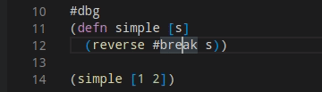

# Debugger

Calva comes with a powerful expression-based debugger, inspired by [Cider](https://cider.mx/)'s debugger, and using the same underlying library, [cider-nrepl](https://github.com/clojure-emacs/cider-nrepl). We hope you love it!


!!! note
    The debugger currently does not support ClojureScript. Calva's debugger utilizes cider-nrepl for debugging. See [this Cider issue](https://github.com/clojure-emacs/cider/issues/1416) for more information.

## Features

### Current

* Set breakpoints with `#break`
* Instrument forms with `#dbg`
* Continue to next breakpoint
* Step over form
* Step into form
* Step out of form
* Evaluate code in the debug context
* See variable values in the debugger side pane
* See variable values on hover in the editor

### Upcoming

* See structured variables in the debugger side pane (currently maps and collections are just shown as strings)
* Command for instrumenting a function (vs adding `#dbg` directly in the code), as well as visual indication that a function is instrumented. This will remove the need to place reader tags in your code file.

## Using the Debugger

If you're new to Clojure or expression-based debuggers, this debugger may function differently than what you're used to. Instead of placing breakpoints in the side margin and then hitting F5 to start debugging, you instead use Clojure reader tags (`#break` and `#dbg`) to denote breakpoints anywhere in a Clojure form. When you evaluate a call to a function that has been evaluated with those reader tags, the debugger will start when execution reaches the first breakpoint.

### Setting Breakpoints with `#break`

You can insert a breakpoint manually into any code by placing a `#break` in front of the form where you want execution to pause, and then evaluating the top level form with `ctrl+alt+c space`. When you evaluate a call to this code the VS Code debugger will start, the cursor will move to right after the form that's preceded by `#break`, and the line will be highlighted so show execution is paused there. You'll also see an annotation for the value of the current form.


!!! note
    Code will be executed up to and *including* the form after the breakpoint.

You can also set conditional breapoints by adding metadata before the form that the `#break` applies to.

```clojure
(defn print-nums [n]
  (dotimes [i n]
    #break ^{:break/when (= i 7)} ;; This breakpoint will only be hit when i equals 7
    (prn i)))
```

### Instrumenting a Form with `#dbg`

Adding `#dbg` before a form then evaluating the form with `ctrl+alt+c space` will instrument the form, meaning breakpoints will be added in places where it makes sense. When you evaluate the form (or a call to a function containing breakpoints), execution will pause wherever breakpoints were added. These breakpoints are not visible in the editor. If you notice execution does not pause, it's likely that no reasonable place was found to place a breakpoint.




### Evaluating Code in the Paused Context

When execution is paused at a breakpoint, you can evaluate code in that context. This can be done in the editor or in the REPL window, as usual. In the REPL window, the prompt changes to `<<debug-mode>>=>` to show that evaluations will occur in the debug context.


### Viewing Variable Values While Debugging

While debugging, you can view the values of variables in VS Code's debugger side pane. You can also view values by hovering over the variables in the editor. Currently, values for collections and maps are shown as strings, but we plan to make them structured in the future. For now, if you want to see the value of a large structured variable, you can evaluate the variable, either from the editor or from the REPL window.


### Stepping Commands

You can use VS Code's debugger UI to advance execution while debugging.


!!! note
    Clicking restart does nothing, since this functionality does not make sense for our debugger.

* **Continue** - Continues without stopping for the current breakpoint
* **Step over** - Continues to the next breakpoint
* **Step in** - Steps in to the function about to be called. If the next breakpoint is not around a function call, does the same as next. Note that not all functions can be stepped in to - only normal functions stored in vars, for which cider-nrepl can find the source. You cannot currently step in to multimethods, protocol functions, or functions in clojure.core (although multimethods and protocols can be instrumented manually).
* **Step out** - Steps to the next breakpoint that is outside of the current sexp
* **Restart** - Does nothing. To restart debugging, you can hit disconnect or continuue execution through the final result, then re-evaluate the expression that started the debugger.
* **Disconnect** - Disconnect the debugger. You likely will see a null pointer exception from `cider.nrepl.middleware.debug/abort!` - this is a known issue and can be ignored (the debugger successfully disconnects).

## Caveats

### Breakpoints in loop/recur

One construct where the debugger is limited is `loop`/`recur`. As recur always has to appear in a tail-position inside a `loop` or a `fn` and the debugger uses macros to interleave breakpoints in the forms it **might** happen that a `recur` no longer appears in a tail position. In that case we have to avoid setting up the breakpoint. An example of such a case is:

```clojure
(loop [i 0]
  #break
  (when (< i 10)
    (println i)
    (recur (inc i))))
```

Here the breakpoint is exactly in front of a form that contains as its last expression a `recur` which is not wrapped in a loop. This breakpoint has no effect. This does not mean you cannot use the debugger with `loop`, it just means you have to set your debug statements more carefully.

### Loading the File and "Eval On Save"

When you load a file, any breakpoints that were previously set in functions will be unset. If you have the "Eval On Save" setting enabled, your file is also loaded with each save, therefore saving the file will remove breakpoints previously set. This loading for "Eval On Save" may be removed in the future so that only evaluation occurs and not loading.

## Troubleshooting

### My breakpoint isn't being hit

It's likely that your breakpoint is in a place that cider-nrepl does not see as an apporpriate place to break execution. For example, if you put a breakpoint before a literal number, it will not be hit, because there's no need to show the value of a literal.

```clojure
(defn simple [x]
  (+ 1 #break 1)) ;; This breakpoint will not be hit
```

Another possible issue is that you're loading the file again after setting breakpoints, which unsets them. See [Loading the File and "Eval On Save"](#loading-the-file-and-eval-on-save) under Caveats.
