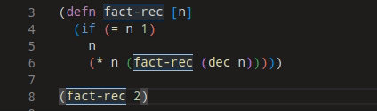
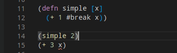
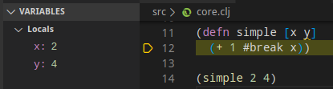

# Debugger

Calva's debugger allows you to place breapoints via reader tags so that execution will pause at those locations. During paused execution, you can see the value of local variables in the side pane, as well as evaluate code within the local context - via the editor or the repl-window, just as you normally would evaluate code. You can also use the step operations to advance execution.



!!! note
    The debugger currently does not support ClojureScript. Calva's debugger utilizes cider-nrepl for debugging. See [this Cider issue](https://github.com/clojure-emacs/cider/issues/1416) for more information.

## Features

### Current

* Set breakpoints with `#break`
* Instrument functions with `#dbg`
* Continue to next breakpoint
* Step over form
* Step into form
* Step out of form
* Evaluate code in the debug context
* See variable values in the debugger side pane
* See variable values on hover in the editor

### Upcoming

* See structured variables in the debugger side pane (currently maps and collections are just shown as strings)
* Command for instrumenting a function (vs adding `#dbg` directly in the code), as well as visual indication that a function is instrumented

## Using the Debugger

### Setting Breakpoints with `#break`

You can insert a breakpoint manually into any code by placing a `#break` in front of the form where you want execution to pause, and then evaluating the top level form with `ctrl+alt+c space`. When you evaluate a call to this code the VS Code debugger will start, the cursor will move to right after the form that's preceded by `#break`, and the line will be highlighted so show execution is paused there. You'll also see an annotation for the value of the current form.


!!! note
    Code will be executed up to and including the form preceding the cursor.

You can also set conditional breapoints by adding metadata before the form that the `#break` applies to.

```clojure
(defn print-nums [n]
  (dotimes [i n]
    #break ^{:break/when (= i 7)}
    (prn i)))
```

### Instrumenting a Function with `#dbg`

Adding `#dbg` before a function definition then evaluating the top-level form with `ctrl+alt+c space` will instrument the function, meaning breakpoints will be added in places where it makes sense. When you evaluate a call to this function, execution will pause wherever breakpoints were added. These breakpoints are not visible in the editor. If you notice execution does not pause, it's likely that no reasonable place was found to place a breakpoint.

### Evaluating Code in the Paused Context

When execution is paused at a breakpoint, you can evaluate code in that context. This can be done in the editor or in the REPL window, as usual. In the REPL window, the prompt changes to `<<debug-mode>>=>` to show that evaluations will occur in the debug context.



### Viewing Variable Values While Debugging

While debugging, you can view the values of variables in VS Code's debugger side pane. You can also view values by hovering over the variables in the editor. Currently, values for collections and maps are shown as strings, but we plan to make them structured in the future. For now, if you want to see the value of a large structured variable, you can evaluate the variable, either from the editor or from the REPL window.



### Stepping Commands

You can use VS Code's debugger UI to advance execution while debugging.


!!! note
    Clicking restart does nothing, since this functionality does not make sense for our debugger.

* **Continue** - Continues without stopping for the current breakpoint
* **Step over** - Continues to the next breakpoint
* **Step in** - Steps in to the function about to be called. If the next breakpoint is not around a function call, does the same as next. Note that not all functions can be stepped in to - only normal functions stored in vars, for which cider-nrepl can find the source. You cannot currently step in to multimethods, protocol functions, or functions in clojure.core (although multimethods and protocols can be instrumented manually).
* **Step out** - Steps to the next breakpoint that is outside of the current sexp
* **Restart** - Does nothing. To restart debugging, you can hit disconnect or continuue execution through the final result, then re-evaluate the expression that started the debugger.
* **Disconnect** - Disconnect the debugger. You likely will see a null pointer exception from `cider.nrepl.middleware.debug/abort!` - this is a known issue and can be ignored (the debugger successfully disconnects).
