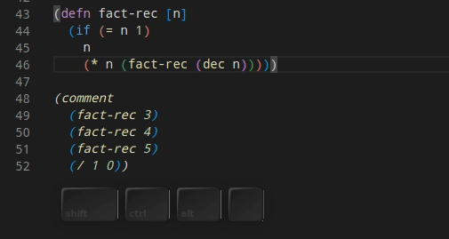

# Something to Try First (After Connecting)

You should start with loading the file you are working with. Do this with **Loading Current File and Dependencies**, `ctrl+alt+c enter`.

To get a feeling for evaluating code in the editor and get immediate response from the REPL try this:

1. On a new line, type a `comment` form and put some code inside it:
    ```clojure
    (comment
      (+ (* 2 2)
         2)
      (Math/abs -1)
      (hello "Calva REPL")
      (defn hello [s]
        (str "Hello " s))
      (range 10)
      "I ♥️ Clojure")
    ```
2. Place the cursor behind the form `(* 2 2)` and issue the command **Calva: Evaluate Current Form**, `ctrl+alt+c e` (`ctrl+alt+c v` on Windows).
    * You should see the result being displayed inline. Press `esc` to dismiss it.
3. Now issue the command **Evaluate Current Top Level Form (defun)**, `ctrl+alt+c space`.
    * You should see the whole form `(+ (* 2 2) 2)` getting highlighted and the result of that expression being displayed inline.
4. Evaluate each form inside the comment form using the **Top Level** command.
    * You should see each one of them evaluated.
    * Evaluating the `(hello "Calva REPL")` form before the `(defn hello...` form should result in an error/exception. Try it again after having evaluated the `defn`form.

Demo:



## How does this work?

Calva has this notion about the **current form**. Issue the **Evaluate Current Form** command, with the cursor placed in different locations to get a feeling for how the current form is determined.

There is also a concept about the **current top level form**. Good for evaluating  various `def`s `defn`, `defthis`, `defthat`. With your cursor placed anywhere inside such a form.

The Top Level command also works inside `(comment ...)` forms, treating the `comment` as creating a new top level context. It is good for in-file code experimentation.

## See also

* [Calva Top 10 Commands](commands-top10.md).
* [Code Evaluation Tips](eval-tips.md)
